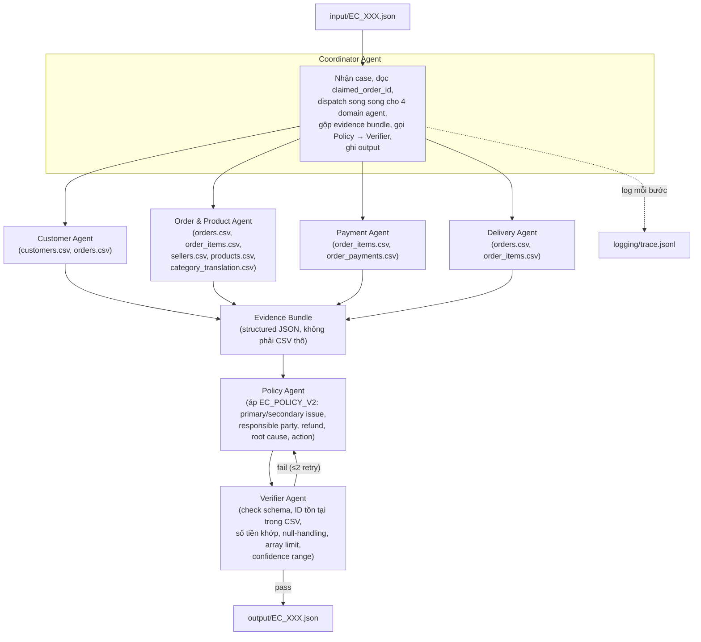

# Kiến trúc hệ thống Multi-Agent — E-commerce Dispute Resolution

## 1. Nguyên tắc thiết kế

1. **Tool-grounded, không free-text arithmetic.** Mọi con số (tiền, giờ, ngày) và mọi ID được tính bằng code (pandas/python) đọc trực tiếp từ `data/*.csv`, không để LLM tự cộng trừ hay tự "nhớ" ID. LLM chỉ được gọi ở bước cần suy luận ngôn ngữ/lựa chọn (đọc yêu cầu khách hàng, chọn nhãn taxonomy khi có nhiều khả năng, viết diễn giải). Lý do: evidence sai định dạng hoặc số tiền sai bị tính **hard gate = 0 điểm/case**, nên phần tính toán bắt buộc phải deterministic.
2. **Phân quyền dữ liệu theo domain.** Mỗi agent chỉ được cấp tool đọc đúng các CSV thuộc domain của nó — không agent nào có quyền ghi hay quyền đọc toàn bộ dataset ngoài phạm vi cần thiết. Điều này buộc phải có **handoff** thật giữa các agent thay vì 1 prompt xử lý hết.
3. **Policy Agent không đọc CSV thô.** Nó chỉ nhận **evidence bundle** đã được các agent domain tổng hợp (dữ liệu có cấu trúc, đã tính sẵn), để áp bảng quyết định `EC_POLICY_V2` một cách nhất quán, tránh việc mỗi agent tự diễn giải policy khác nhau.
4. **Verifier là cổng chặn cuối, có quyền phủ quyết.** Trước khi ghi file, Verifier đối chiếu lại toàn bộ ID/số tiền/giới hạn mảng với dữ liệu gốc; nếu sai, case được trả ngược lại pipeline để sửa (giới hạn số lần retry) thay vì ghi thẳng ra `output/`.
5. **Mọi lời gọi agent đều được log vào `logging/trace.jsonl`** (input, output, tool calls, model dùng) để phục vụ audit và chấm điểm.

## 2. Sơ đồ agent



## 3. Vai trò, quyền truy cập và model

| Agent | Trách nhiệm | Dữ liệu được đọc (read-only) | Không được truy cập | Output bàn giao |
|---|---|---|---|---|
| **Coordinator** | Nhận `input/EC_XXX.json`, điều phối thứ tự gọi agent, gộp evidence bundle, gọi Policy → Verifier, ghi `output/EC_XXX.json`, ghi trace | `input/*.json` | không đọc CSV trực tiếp | Case output cuối cùng |
| **Customer Agent** | Từ `claimed_order_id` → tra `orders.customer_id` → `customers.customer_unique_id`; tìm các order khác cùng `customer_unique_id` (≠ order hiện tại), giữ tối đa 5, thứ tự theo `order_purchase_timestamp` | `customers.csv`, `orders.csv` | order_items, payments, products | `customer_context` (customer_unique_id, related_order_ids) |
| **Order & Product Agent** | Lấy toàn bộ item row của order, seller_id, product_id, category (join `product_category_name_translation`), cờ multi-item/multi-seller/multiple-categories | `orders.csv`, `order_items.csv`, `sellers.csv`, `products.csv`, `product_category_name_translation.csv` | payments, customers | `affected_entities` (item/seller), `product_context`, danh sách seller cho Delivery Agent dùng |
| **Payment Agent** | Tổng `item_total_brl`, `freight_total_brl` từ item; tổng `payment_total_brl` từ payment rows; `expected_total_brl`, `difference_brl`, `reconciled` (sai số 0.10 BRL); danh sách `payment_types`; cờ `split_payment` | `order_items.csv` (price, freight), `order_payments.csv` | products, delivery timestamps | `payment_reconciliation`, payment evidence IDs |
| **Delivery Agent** | `delivery_variance_hours` = delivered − estimated; với mỗi seller trong order, lấy `shipping_limit_date` sớm nhất → `handoff_variance_hours` so với `order_delivered_carrier_date`, cờ `late_handoff` từng seller | `orders.csv`, `order_items.csv` (shipping_limit_date, seller_id) | payments, products | `delivery_analysis`, `late_handoff_seller_ids` |
| **Policy Agent** | Áp bảng quyết định `EC_POLICY_V2` theo đúng thứ tự ưu tiên trên evidence bundle: primary issue → secondary issues (đúng thứ tự 1-5) → responsible party → refund → root cause code → resolution actions (đúng thứ tự); build `evidence_ids` | **Không đọc CSV** — chỉ nhận evidence bundle có cấu trúc từ Coordinator | mọi CSV thô | `case_assessment`, `root_cause_analysis`, `financial_resolution`, `resolution_actions`, `evidence_ids` |
| **Verifier Agent** | Đối chiếu output cuối với dữ liệu gốc: mọi ID trong `evidence_ids`/`affected_entities` phải dựng được từ CSV thật; số tiền khớp với Payment Agent; null-handling đúng khi order không có item; kiểm giới hạn mảng (5/5/3/5/5/5/5/3/3/20/5); `confidence ∈ [0,1]`; timestamp giữ nguyên format CSV | Toàn bộ CSV (chỉ để spot-check, không để tính lại business logic) + output JSON đang xét | — | Pass → cho ghi file; Fail → trả lỗi cụ thể về Policy Agent để sửa |

**Model:** mỗi agent dùng 1 model LLM ≤ 10B parameters (tên model cụ thể + kích thước khai báo trong code và trong `logging/metadata.json`, không đặt trong `.env`). Các agent domain (Customer/Order&Product/Payment/Delivery) chủ yếu gọi tool tính toán xác định; LLM trong các agent này dùng để đọc `customer_request.message`, chọn tool phù hợp và tóm tắt evidence — không dùng LLM để tự tính số.

## 4. Data contract giữa các agent (evidence bundle)

Coordinator gộp 4 output domain thành 1 object duy nhất trước khi gửi cho Policy Agent, ví dụ rút gọn:

```json
{
  "order": { "order_id": "...", "order_status": "...", "timestamps": {...} },
  "items": [{ "order_item_id": 1, "product_id": "...", "seller_id": "...", "price": 0, "freight_value": 0 }],
  "sellers_involved": ["..."],
  "payments": [{ "payment_sequential": 1, "payment_type": "...", "payment_value": 0 }],
  "customer_context": { "customer_unique_id": "...", "related_order_ids": ["..."] },
  "product_context": { "product_ids": ["..."], "category_names": ["..."] },
  "delivery_analysis": { "...theo schema output..." },
  "payment_reconciliation": { "...theo schema output..." }
}
```

Policy Agent chỉ được phép suy ra `case_assessment`, `root_cause_analysis`, `financial_resolution`, `resolution_actions`, `evidence_ids` từ object này — không được thêm field nào không xuất phát từ evidence bundle.

## 5. Xử lý lỗi và retry

- Nếu một domain agent không tìm thấy dữ liệu (vd. order không có item row) → trả field `null`/mảng rỗng đúng theo README mục 4, không throw lỗi làm dừng pipeline.
- Nếu Verifier fail → Coordinator gọi lại Policy Agent tối đa 2 lần kèm danh sách lỗi cụ thể; sau 2 lần vẫn fail → case được đánh dấu lỗi trong trace và log rõ nguyên nhân (không ghi output sai ra `output/`).
- Toàn bộ input/output/tool-call của từng agent, từng case được append vào `logging/trace.jsonl` (một lượt chạy mới nhất, không giữ lịch sử cũ).

## 6. Vì sao chọn kiến trúc này

- **Tách domain theo agent + evidence bundle bắt buộc phải đi qua Coordinator** đảm bảo có handoff thật, đúng yêu cầu chấm điểm (không phải 1 prompt xử lý hết).
- **Tách phần tính toán deterministic (tool) khỏi phần suy luận ngôn ngữ (LLM)** giảm rủi ro hallucination về ID/số tiền — nguồn gốc chính của hard-gate 0 điểm.
- **Verifier độc lập, có quyền trả ngược** mô phỏng đúng tinh thần nghiệp vụ thực tế: nhân viên đối soát luôn được kiểm tra chéo trước khi duyệt hoàn tiền.
